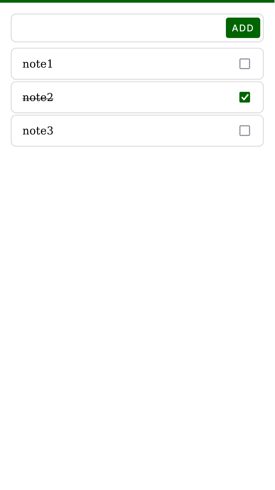

# React Todo App

Simple todo app created with React.

### Screenshot

### Deployed at [frontend-todo-app-react.netlify.app](https://frontend-todo-app-react.netlify.app/)

Netlify automatically re-build and re-deploys the app on push.

### CI and Test

* Uses GitHub Actions.
* `src/test` contains all unit/ui-unit tests.
* `e2e.test.js` have end-to-end tests.
* I do not know if I have any integration tests. Neglecting ui-unit test which tests react components.

### Structure

* Tried to separate the UI from the Logical/Domain/Business part of the app.
* `src/ui` contains the UI related code which uses react.
* Tried to separate the UI into different screens
  * this app has only one screen, named `app_screen`
* More info in `note.txt`